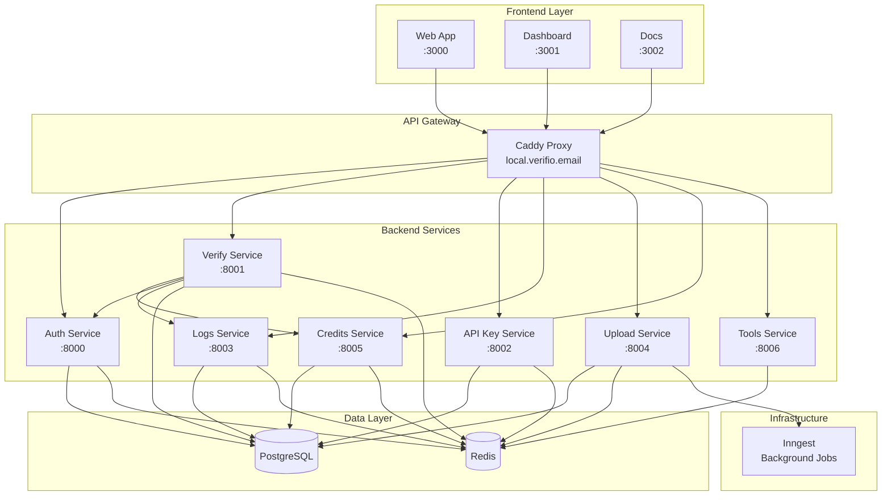
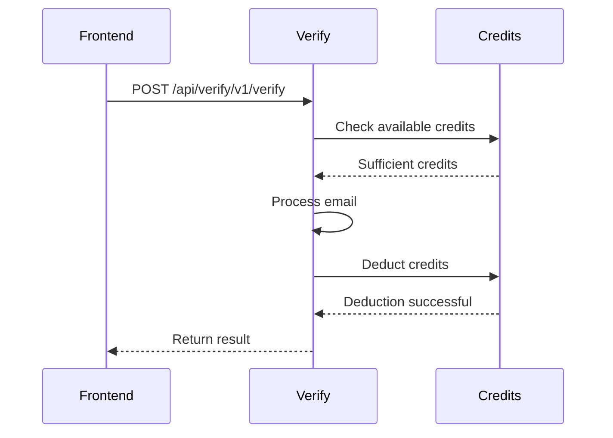
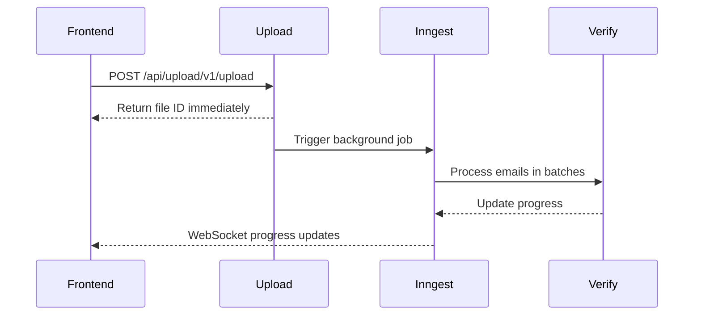
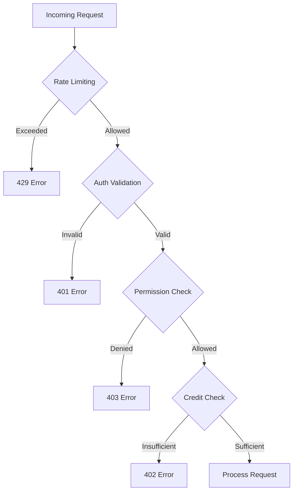
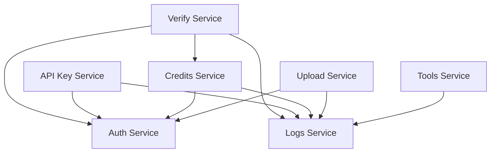

import { Callout } from 'fumadocs-ui/components/callout'

# Backend Architecture

Verifio's backend is a **microservices architecture** built with ElysiaJS and Bun, designed for scalability, maintainability, and independent deployment.

## System Overview



## Architecture Principles

### 1. Service Independence

Each backend service is independently deployable:

- **Separate package.json** - Own dependencies and scripts
- **Individual ports** - No port conflicts
- **Health checks** - Independent monitoring
- **Database schema** - Shared via `@verifio/db` package

### 2. Workspace Dependencies

Services share packages via **Bun workspace**:

```typescript
// Import database schema
import { db } from "@verifio/db/client";
import * as schema from "@verifio/db/schema";

// Import logger
import { logger } from "@verifio/logger";

// Import cache
import { redis } from "@verifio/cache";
```

<Callout type="info">
  **Key Design**: Backend services import shared packages directly (not HTTP calls), while frontend → backend communication is HTTP-based.
</Callout>

### 3. HTTP-Based Service Communication

Services communicate via HTTP for loose coupling:

```typescript
// Verify service calling Credits service
const response = await fetch('http://localhost:8005/api/credits/v1/deduct', {
  method: 'POST',
  headers: {
    'Content-Type': 'application/json',
    'Cookie': headers.cookie,  // Forward user context
  },
  body: JSON.stringify({ amount: 100 }),
});
```

### 4. Cookie Forwarding

User context is maintained via cookie forwarding:

```typescript
// Service A receives request with session cookie
// Service A forwards cookie to Service B
const response = await fetch('http://localhost:800X/api/endpoint', {
  headers: {
    'Cookie': headers.cookie,  // Forward session
  },
});
```

## Service Communication Patterns

### 1. Synchronous HTTP

Services make direct HTTP calls for real-time operations:



### 2. Asynchronous Background Jobs

Long-running tasks use Inngest for background processing:



### 3. Event-Driven Logging

Services emit log events asynchronously:

```typescript
// Non-blocking log operation
async function logActivity(data) {
  try {
    await fetch(`${BASE_URL}/api/logs/v1/add`, {
      method: 'POST',
      body: JSON.stringify(data),
    });
  } catch (error) {
    // Log failures don't break main operation
    console.error('Failed to log:', error);
  }
}
```

## Data Layer Architecture

### Database Strategy

**Single PostgreSQL Instance** with schema sharing:

```
packages/db/
  src/
    schema/
      auth.ts          # user, session, account, organization, member
      api-key.ts       # apikey
      verification.ts  # verificationJob, verificationResult
      credits.ts       # orgCredits, creditHistory
      upload.ts        # upload
      activity-logs.ts # activityLogs
```

<Callout type="warn">
  **Important**: The database schema is the **single source of truth**. All services import from `@verifio/db/schema`.
</Callout>

### Caching Strategy

**Redis** is used for:

- **Session Storage** - User sessions (Auth service)
- **Rate Limiting** - Per-IP and per-key rate limits
- **API Caching** - Cache expensive operations
- **Distributed Locks** - Prevent duplicate processing

```typescript
// Redis-backed rate limiting
import { redis } from "@verifio/cache";

const key = `ratelimit:${ip}:${endpoint}`;
const count = await redis.incr(key);

if (count === 1) {
  await redis.expire(key, 60);  // 60 second window
}

if (count > limit) {
  throw new Error('Rate limit exceeded');
}
```

## Technical Patterns

### 1. ElysiaJS Plugin Composition

Services use a composable plugin pattern:

```typescript
import { Elysia } from 'elysia';
import { cors } from '@elysiajs/cors';
import { openapi } from '@elysiajs/openapi';
import { serverTiming } from '@elysiajs/server-timing';

const app = new Elysia({ prefix: '/api/service' })
  .use(cors({
    origin: ['http://localhost:3000', 'http://localhost:3001'],
    credentials: true,
  }))
  .use(openapi({ documentation: {...} }))
  .use(serverTiming())
  .use(healthRoute)
  .use(mainRoutes)
  .listen({ port: 8001 });
```

### 2. Macro-Based Auth

Custom macros for route protection:

```typescript
const authMiddleware = new Elysia().macro({
  auth: {
    async resolve({ headers }) {
      // Validate session or API key
      const session = await validateSession(headers.cookie);
      if (!session) {
        throw new Error('Unauthorized');
      }
      return { user: session.user, organization: session.organization };
    }
  }
});

// Apply to routes
.post('/endpoint', handler, { auth: true })
```

### 3. Atomic Operations

Database operations use atomic queries to prevent race conditions:

```typescript
// Atomic credit deduction
const result = await db.execute(sql`
  UPDATE org_credits
  SET credits_used = credits_used + $1
  WHERE id = $2
    AND credit_limit - credits_used >= $1
  RETURNING *
`, [amount, orgId]);

if (!result.rows[0]) {
  throw new Error('Insufficient credits');
}
```

## Security Architecture

### Defense in Depth



### Security Layers

1. **Network Layer** - Caddy reverse proxy with HTTPS
2. **Rate Limiting** - Multi-layered (IP, fingerprint, email)
3. **Authentication** - Session cookies or API keys
4. **Authorization** - Organization-based access control
5. **Rate Limits** - Per-organization credit limits
6. **Input Validation** - All inputs validated before processing
7. **SQL Injection Prevention** - Parameterized queries via Drizzle ORM

## Scalability Patterns

### Horizontal Scaling

Services can be scaled independently:

```bash
# Scale verify service to 3 instances
docker-compose up --scale verify-service=3
```

### Stateless Services

All services are stateless (except Redis/PostgreSQL):

- **No in-memory state** - All state in Redis or PostgreSQL
- **Multiple instances** - Can run behind load balancer
- **Graceful shutdown** - Handle SIGTERM for zero-downtime deploys

### Connection Pooling

Database connections are pooled for efficiency:

```typescript
// Drizzle automatically handles connection pooling
export const db = drizzle(pgURL, {
  schema,
  poolSize: 20,  // Adjust based on load
  poolMaxUses: 7500,
});
```

## Error Handling

### Standard Error Response Format

```typescript
{
  success: false,
  error: "Error message",
  data?: {
    // Optional context
  }
}
```

### HTTP Status Codes

| Code | Usage | Example |
|------|-------|---------|
| 200 | Success | Verification completed |
| 201 | Created | API key created |
| 400 | Bad Request | Invalid email format |
| 401 | Unauthorized | Invalid session |
| 402 | Payment Required | Insufficient credits |
| 403 | Forbidden | No permission |
| 404 | Not Found | Resource doesn't exist |
| 429 | Too Many Requests | Rate limit exceeded |
| 500 | Internal Server Error | Unexpected error |
| 503 | Service Unavailable | Service down |

## Performance Optimization

### 1. Database Indexes

Frequently queried fields are indexed:

```typescript
// orgCredits table
export const orgCredits = pgTable('org_credits', {
  id: text('id').primaryKey(),
  organizationId: text('organization_id').notNull().unique(),  // Indexed
  // ...
});
```

### 2. Redis Caching

Expensive operations are cached:

```typescript
// Cache organization credit status
const cacheKey = `credits:${orgId}`;
let credits = await redis.get(cacheKey);

if (!credits) {
  credits = await db.query.orgCredits.findFirst({
    where: eq(orgCredits.organizationId, orgId),
  });
  await redis.setex(cacheKey, 60, JSON.stringify(credits));  // 60s TTL
}
```

### 3. Batch Processing

Bulk operations process in batches:

```typescript
const BATCH_SIZE = 10;

for (let i = 0; i < emails.length; i += BATCH_SIZE) {
  const batch = emails.slice(i, i + BATCH_SIZE);
  await Promise.all(batch.map(verifyEmail));
}
```

## Monitoring & Observability

### Health Checks

All services expose `/health` endpoint:

```typescript
.get('/health', async () => {
  // Check database
  await db.execute(sql`SELECT 1`);

  // Check Redis
  await redis.ping();

  return { status: 'ok' };
})
```

### Structured Logging

Using Pino for structured logging:

```typescript
import { logger } from '@verifio/logger';

logger.info({
  userId,
  organizationId,
  action: 'email.verify',
  durationMs,
}, 'Email verified successfully');
```

### Activity Tracking

All operations logged to `activityLogs` table:

```typescript
await fetch(`${BASE_URL}/api/logs/v1/add`, {
  method: 'POST',
  body: JSON.stringify({
    service: 'verify',
    endpoint: '/api/verify/v1/verify',
    method: 'POST',
    status: 'success',
    creditsUsed: 1,
    durationMs: 2340,
    ipAddress,
    userAgent,
  }),
});
```

## Deployment Architecture

### Local Development

```
┌─────────────────────────────────────┐
│  Docker Compose (Infrastructure)    │
│  - PostgreSQL                       │
│  - Redis                            │
│  - Caddy (reverse proxy)            │
│  - Inngest                          │
└─────────────────────────────────────┘
              ↓
┌─────────────────────────────────────┐
│  Backend Services (Bun)             │
│  - Auth (8000)                      │
│  - Verify (8001)                    │
│  - API Key (8002)                   │
│  - Logs (8003)                      │
│  - Upload (8004)                    │
│  - Credits (8005)                   │
│  - Tools (8006)                     │
└─────────────────────────────────────┘
              ↓
┌─────────────────────────────────────┐
│  Frontend Apps (Next.js)            │
│  - Web (3000)                       │
│  - Dashboard (3001)                 │
│  - Docs (3002)                      │
└─────────────────────────────────────┘
```

### Production

```
┌─────────────────────────────────────┐
│  Load Balancer / CDN                │
└─────────────────────────────────────┘
              ↓
┌─────────────────────────────────────┐
│  Backend Services (Scaled)          │
│  - Multiple instances per service   │
│  - Health checks for load balancing │
└─────────────────────────────────────┘
              ↓
┌─────────────────────────────────────┐
│  Managed Data Services              │
│  - PostgreSQL (RDS/Cloud SQL)       │
│  - Redis (ElastiCache/ Memorystore) │
└─────────────────────────────────────┘
```

## Service Dependencies

### Dependency Graph



### Service Startup Order

Critical services must start before dependent services:

```bash
# 1. Infrastructure
bun run docker:up

# 2. Core services (no dependencies)
bun run be:auth:dev
bun run be:api-key:dev
bun run be:credits:dev
bun run be:tools:dev

# 3. Dependent services
bun run be:verify:dev    # Depends on: auth, credits
bun run be:upload:dev    # Depends on: auth
bun run be:logs:dev      # Depends on: auth
```

<Callout type="info">
  Use `bun run verifio:dev` to start all services in the correct order automatically.
</Callout>

## Related Documentation

- **Individual Service Docs** - Detailed setup and configuration for each service
- **Database Schema** - Complete table definitions and relationships
- **Authentication & Security** - Security best practices and patterns
- **Troubleshooting** - Common issues and solutions

## Next Steps

- Read individual service documentation for detailed setup
- Review database schema for data model understanding
- Check authentication guide for security implementation
- See troubleshooting guide for common issues
