import { Callout } from 'fumadocs-ui/components/callout'

# Architecture Diagrams

Visual representations of Verifio's architecture, service communication, and data flows.

## System Architecture Overview

```mermaid
graph TB
    subgraph "Users"
        Users[End Users<br/>Dashboard Users<br/>API Consumers]
    end

    subgraph "Frontend Layer"
        Web[Web App<br/>:3000]
        Dashboard[Dashboard<br/>:3001]
        Docs[Docs<br/>:3002]
        Blog[Blog<br/>:3003]
    end

    subgraph "API Gateway"
        Caddy[Caddy Reverse Proxy<br/>local.verifio.email<br/>HTTPS Termination]
    end

    subgraph "Backend Services"
        Auth[Auth Service<br/>:8000<br/>Authentication & Sessions]
        Verify[Verify Service<br/>:8001<br/>Email Verification]
        APIKey[API Key Service<br/>:8002<br/>API Key Management]
        Logs[Logs Service<br/>:8003<br/>Activity Logging]
        Upload[Upload Service<br/>:8004<br/>File Upload]
        Credits[Credits Service<br/>:8005<br/>Credit Management]
        Tools[Tools Service<br/>:8006<br/>Free Tools]
    end

    subgraph "Data Layer"
        PostgreSQL[(PostgreSQL<br/>Primary Database)]
        Redis[(Redis<br/>Cache & Sessions)]
    end

    subgraph "Infrastructure"
        Inngest[Inngest<br/>Background Jobs]
    end

    Users --> Web
    Users --> Dashboard
    Users --> Docs
    APIConsumers[API Consumers] --> Caddy

    Web --> Caddy
    Dashboard --> Caddy
    Docs --> Caddy
    Blog --> Caddy

    Caddy --> Auth
    Caddy --> Verify
    Caddy --> APIKey
    Caddy --> Logs
    Caddy --> Upload
    Caddy --> Credits
    Caddy --> Tools

    Verify -.->|Validate Session| Auth
    Verify -.->|Check Credits| Credits
    Verify -.->|Log Activity| Logs

    APIKey -.->|Log Activity| Logs

    Upload -.->|Log Activity| Logs
    Upload -.->|Background Processing| Inngest

    Credits -.->|Log Activity| Logs

    Auth --> PostgreSQL
    Auth --> Redis

    Verify --> PostgreSQL
    Verify --> Redis

    APIKey --> PostgreSQL
    APIKey --> Redis

    Logs --> PostgreSQL
    Logs --> Redis

    Upload --> PostgreSQL
    Upload --> Redis

    Credits --> PostgreSQL
    Credits --> Redis

    Tools --> Redis
```

## Authentication Flow

### Email/Password Authentication

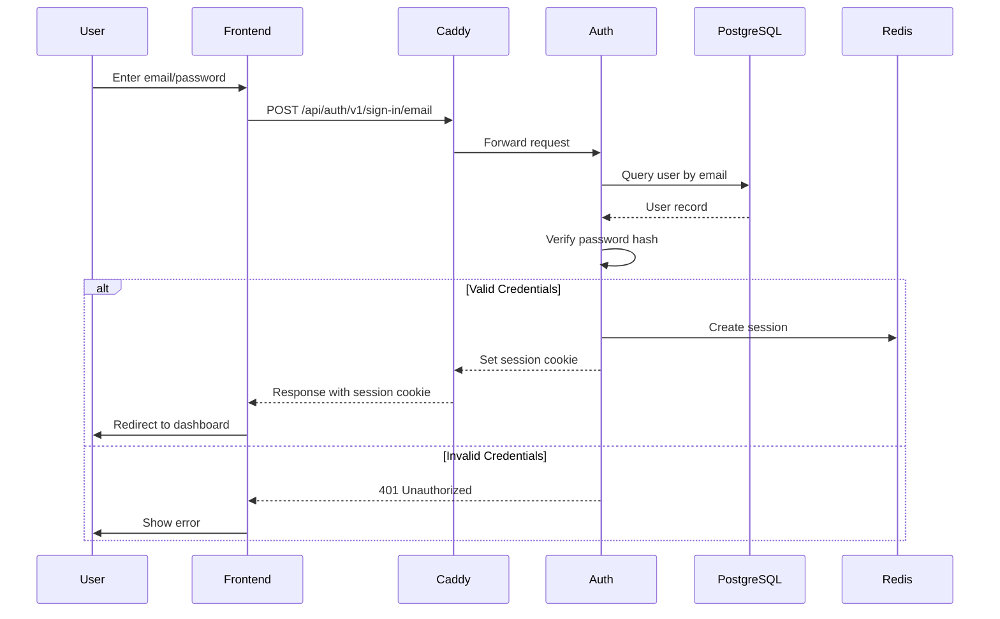

### OAuth Authentication (Google/GitHub)

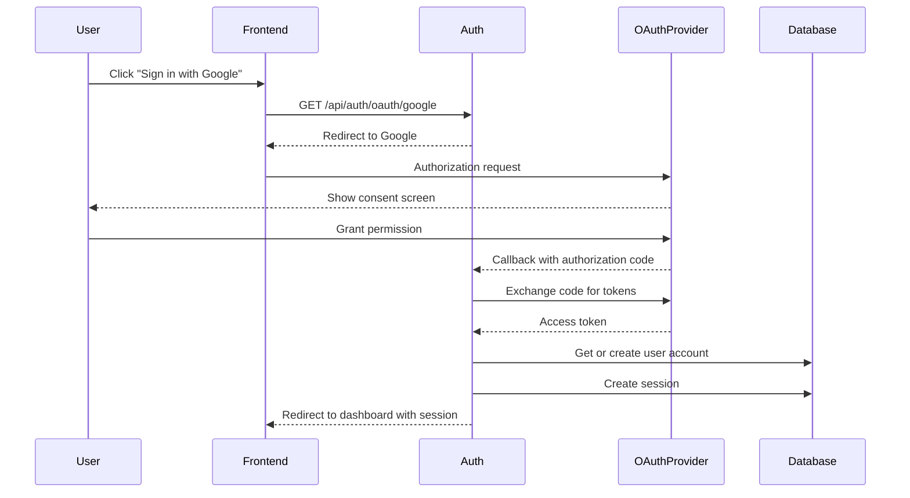

### API Key Authentication

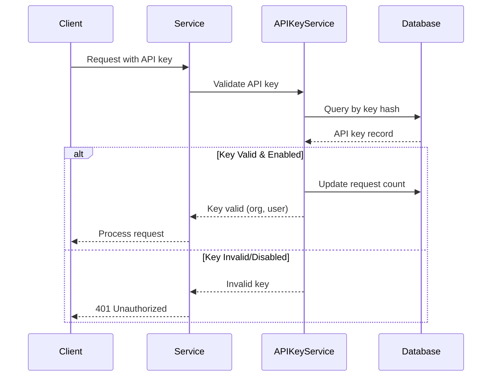

## Email Verification Flow

### Single Email Verification

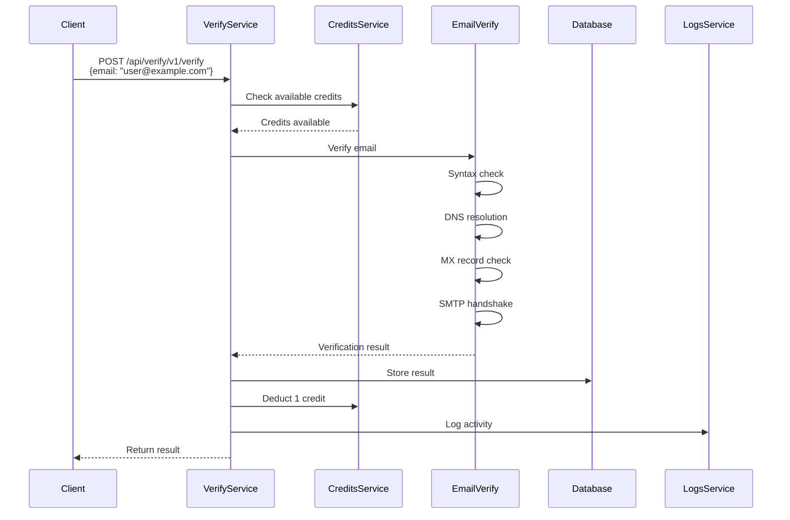

### Bulk Email Verification

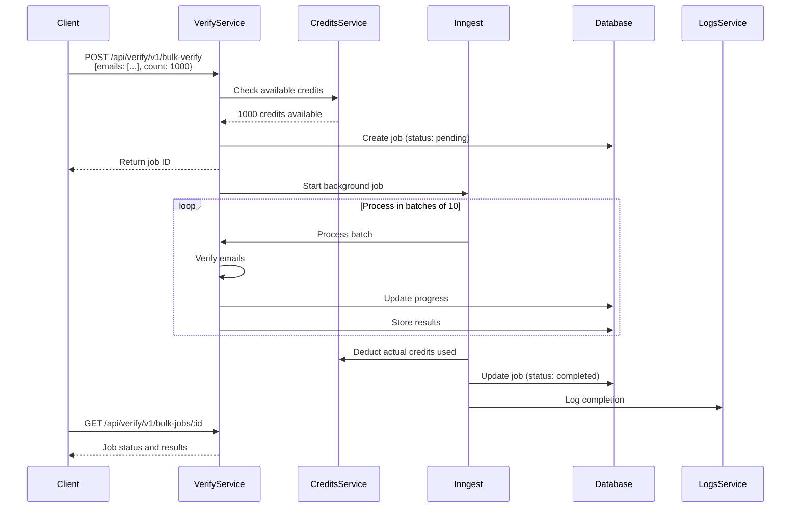

## Credit Management Flow

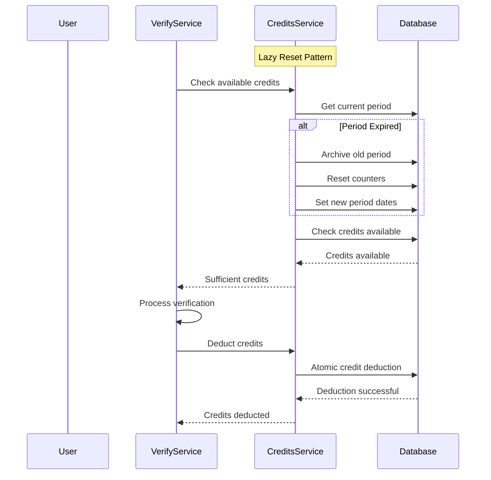

## Data Flow: API Request with Session Auth

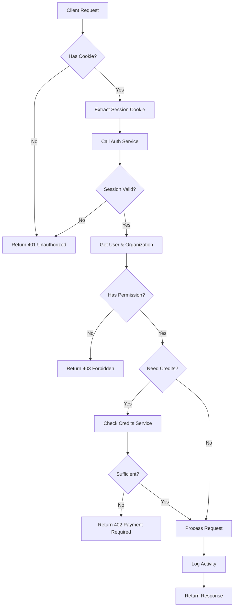

## Data Flow: API Request with API Key

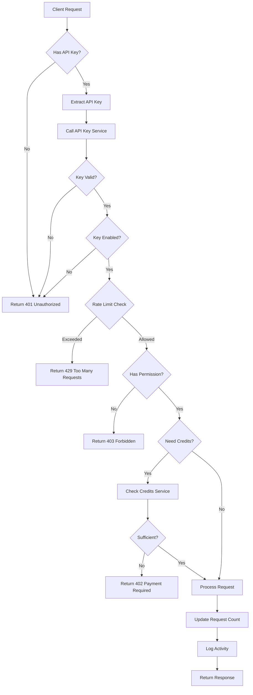

## Service Dependencies

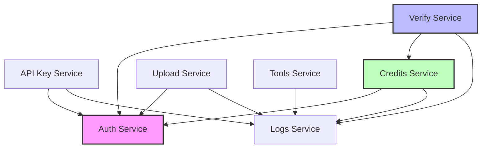

## Database Schema Relationships

```mermaid
erDiagram
    user ||--o{ session : has
    user ||--o{ account : has
    user ||--o{ member : has
    user ||--o{ upload : uploads

    organization ||--o{ member : has
    organization ||--o{ apikey : has
    organization ||--o{ orgCredits : has
    organization ||--o{ verificationJob : creates
    organization ||--o{ upload : owns
    organization ||--o{ activityLogs : logs

    member }o--|| user : belongs to
    member }o--|| organization : belongs to

    verificationJob ||--o{ verificationResult : has
    verificationJob }o-o| upload : uses

    apikey }o--|| organization : belongs to

    orgCredits }o--|| organization : belongs to

    creditHistory }o--|| organization : belongs to

    upload }o--|| organization : belongs to
    upload }o--|| user : uploaded by

    activityLogs }o--|| organization : logged in
    activityLogs }o-o| user : performed by
    activityLogs }o-o| apikey : performed with
```

## Rate Limiting Architecture

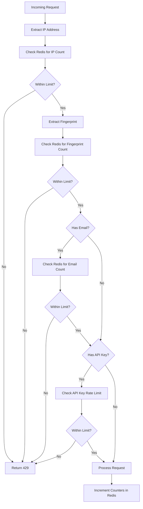

## Deployment Architecture

### Local Development

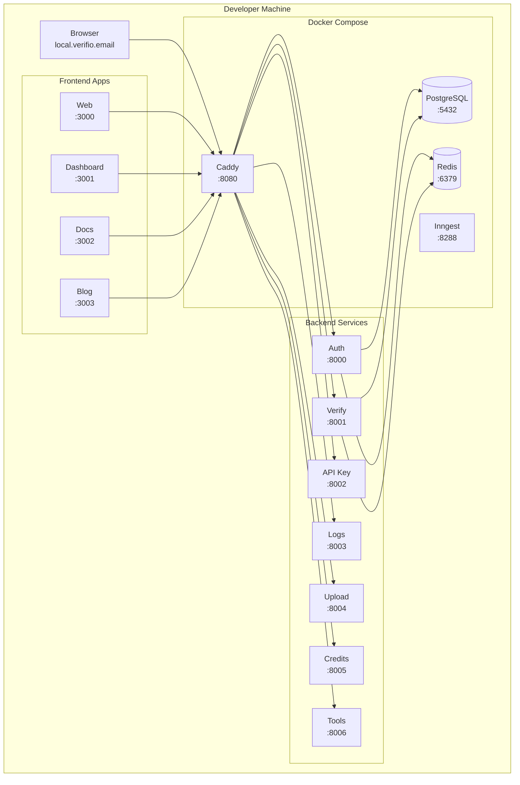

### Production (Simplified)

```mermaid
graph TB
    subgraph "Users"
        Users[End Users<br/>API Consumers]
    end

    subgraph "CDN / Load Balancer"
        CDN[Cloudflare/AWS CloudFront]
    end

    subgraph "Application Servers"
        subgraph "Frontend Cluster"
            F1[Web App 1]
            F2[Web App 2]
            F3[Dashboard 1]
        end

        subgraph "Backend Cluster"
            B1[Auth Service]
            B2[Verify Service]
            B3[API Key Service]
            B4[Credits Service]
            B5[Logs Service]
            B6[Upload Service]
        end
    end

    subgraph "Data Layer"
        PG[(RDS PostgreSQL<br/>Multi-AZ)]
        RD[(ElastiCache Redis<br/>Cluster Mode)]
    end

    subgraph "Background Jobs"
        Inngest[Inngest Cloud]
    end

    Users --> CDN
    CDN --> F1
    CDN --> F2
    CDN --> F3

    F1 --> B1
    F1 --> B2
    F3 --> B1
    F3 --> B3

    B1 --> PG
    B1 --> RD
    B2 --> PG
    B2 --> RD
    B3 --> PG
    B3 --> RD
    B4 --> PG
    B4 --> RD
    B5 --> PG
    B5 --> RD
    B6 --> PG
    B6 --> RD

    B2 -.->|Queue Jobs| Inngest
    B6 -.->|Queue Jobs| Inngest
```

## Security Layers

```mermaid
flowchart LR
    A[Incoming Request] --> B[Network Security<br/>HTTPS Only]
    B --> C[CORS Validation<br/>Allowed Origins]
    C --> D[Rate Limiting<br/>Multi-Layer]
    D --> E[Authentication<br/>Session or API Key]
    E --> F[Authorization<br/>Organization Access]
    F --> G[Input Validation<br/>Schema Validation]
    G --> H[Rate Limiting<br/>Credit Check]
    H --> I[Request Processing]
    I --> J[Audit Logging<br/>Activity Tracking]

    style A fill:#f99
    style B fill:#fc9
    style C fill:#fe9
    style D fill:#ff9
    style E fill:#9f9
    style F fill:#9fc
    style G fill:#9ff
    style H fill:#9cf
    style I fill:#99f
    style J fill:#fcf
```

<Callout type="info">
  **Note**: These diagrams use Mermaid syntax and will render in supported Markdown viewers. For the best viewing experience, use the Fumadocs documentation site.
</Callout>

## Related Documentation

- **Backend Architecture** - Detailed technical architecture
- **Database Schema** - Complete data model
- **Authentication & Security** - Security implementation details
- **Individual Service Docs** - Service-specific architecture

## Diagram Legend

| Symbol | Meaning |
|--------|---------|
| `-->` | Synchronous call |
| `-.->` | Asynchronous call |
| `\|\|--o{` | One-to-many relationship |
| `}o--\|\|` | Many-to-one relationship |
| `}o--o{` | Many-to-many relationship |
| Database[( )] | Database |
| Cache[( )] | Cache/Redis |
| Service[ ] | Service/Application |
